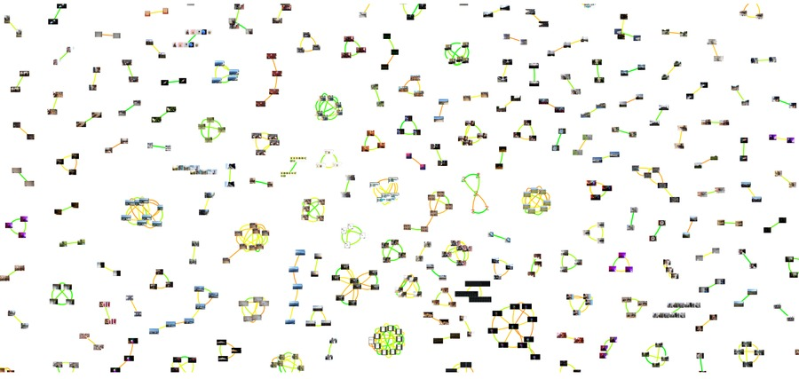
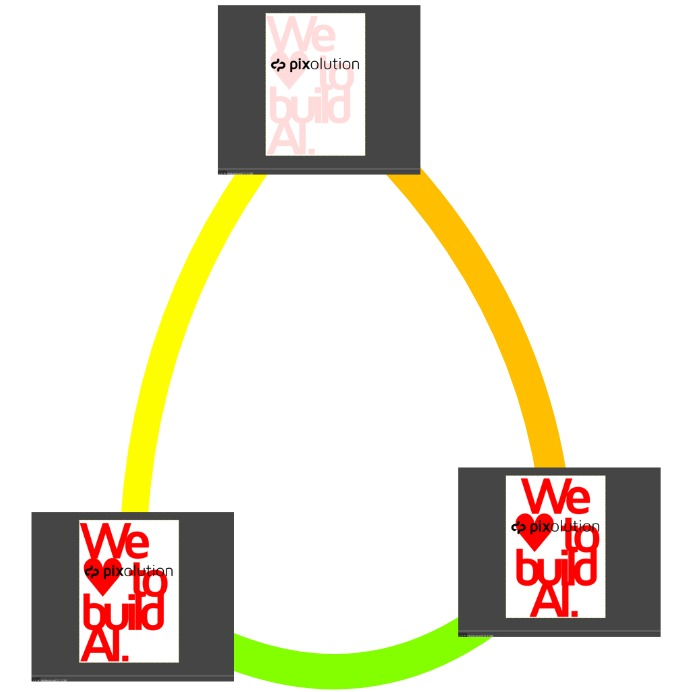

# Dupe Scanner



Find exact and near-duplicate images in your local folders using [Flow 5](https://pixolution.io/duplicate-detection/) as analysis and search backend.
Detected duplicates are exported as interactive [HTML graph visualization](#html) and as [JSON](#json) with filepaths for further processing.

## Features

* __Local Processing__: Analyze and process images directly on your device.
* __Advanced Duplicate Detection__: Identify duplicates with variations in saturation, brightness, color, size, format, orientation, clarity, cropping, and text addition.
* __Adjustable Sensitivity__: Customize detection levels for exact and near-duplicates.
* __Graphical Result Inspection__: Utilize graph visualization for easy examination of duplicates.
* __JSON Output__: Receive organized results as JSON file, listing groups of duplicate images.

## Prerequisites

List of system requirements:
* OS: Linux
* CPU `x86_64` / `AMD64` architecture
* Docker
* Python >= 3.9

## Setup

1. In project root dir create a Python virtual environment
    ```sh
    python3 -m venv venv
    ```
1. Activate venv
    ```sh
    source venv/bin/activate
    ```
1. Install packages in the virtual env
    ```sh
    pip3 install --upgrade -r requirements.txt
    ```
1. Start a local Flow 5 server (image analysis and search engine) in background.
    ```sh
    docker run -d --rm -p8983:8983 --name local-flow-server pixolution/flow
    ```

## Scan for duplicate images

1. Ensure that setup is ok and local Flow service is accessible.
    ```sh
    python3 scanner.py status
    ```

1. First you have to index local images to the Flow collection. The images are analyzed by and indexed to the running Flow server.
    ```sh
    python3 scanner.py index --dir <PATH-TO-IMAGE-FOLDER>
    ```
    Depending on your CPU and the number of images this process takes a while (each image is analyzed by multiple AI models).

1. Once the images are indexed you can scan the collection for duplicate images.
    ```sh
    python3 scanner.py scan
    ```
    This is an example scan output:
    ```sh
    (venv) $  python3 scanner.py scan
    Process 544 images. Start scanning (this may take a while)...
    100%|████████████████████████████████████| 544/544 [00:07<00:00, 74.19scans/s]
    Export 81 duplicate groups to duplicates.json...
    Detected 290 duplicate images. Export results to duplicates.html ...
    100%|████████████████████| 290/290 [00:01<00:00, 220.92thumbnails generated/s]
    ```


## Inspect results

The scan results are exported in two files:
```
|- duplicates.html
|- duplicates.json
```

### HTML

The `duplicates.html` contains an interactive visualization of duplicate images as graph network.
This HTML file is standalone and can be easily shared, since all images are embedded as thumbnails.
Zoom in to inspect the results visually. Hover over an edge to see the similarity score.
Hover over an image to see its file path.



The color of the edges between the nodes (images) display the similarity of the two connected images.
 * Green = exact duplicates with no or minor changes
 * Yellow = near-duplicates
 * Red = near-duplicates with major changes

### JSON

The `duplicates.json` file can be easily processed further and contains the file paths per duplicate group.

```json
{
    "group-1": [
        "/home/user/images/page.png",
        "/home/user/images/work/page-1.jpg"
    ],
    "group-2": [
        "/home/user/images/201002.jpg",
        "/home/user/images/201100021-2.png",
        "/home/user/images/copy.jpg",
    ],
    [...]
}
```


## Scale up
We are the team behind the image analysis and search product __Flow 5__ and we hope that this Python tool is useful to you.

The free Starter version of Flow 5 is limited to 5,000 images.
If you need to process high-volumes and want to integrate de-duplication in your production workflows, please see [Flow 5 pricing](https://pixolution.io/pricing).

Also, if you are interested in more sophisticated de-duplication or image analysis services feel free to [contact us](https://pixolution.io/contact).


## Clean up

To stop the Flow Docker once finished, be aware that indexed data will not be retained.
```sh
docker stop local-flow-server
```
